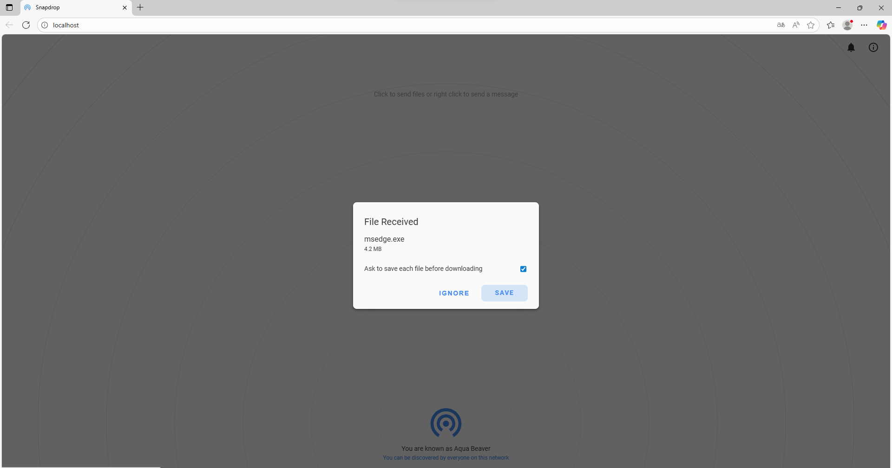
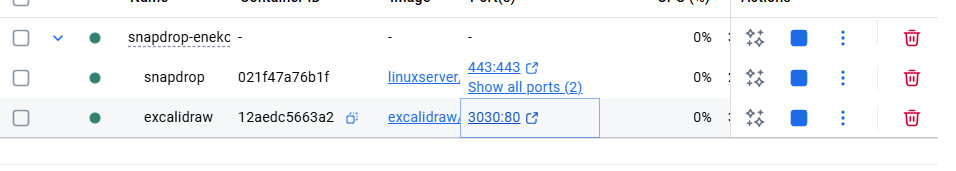

# Despliega tu segunda aplicación con Docker (Snapdrop)

### 1. Ejercicio: Despliega el proyecto de docker compose y responde a las siguientes preguntas.

1. Snapdrop se trata de una aplicación para transferir archivos entre equipos a través de la red, averigua tu ip y trata de transferir archivos con algún compañero de clase, ambos teneis que conectaros al mismo servidor. Muestra una captura de la aplicación Snapdrop en el momento de recibir un archivo.

Por ejemplo, la dirección de este equipo es:
`INF200615-8GELA.zornotzalh.eus`

2. ¿Que puertos expone esta aplicacion? ¿Sabrías decirme para que protocolos e usan estos puertos?

    -->443:443 y 80:80 y usan los protoclos http y https

3. ¿Cuantos contenedores incluye este proyecto? 

    -->2 contenedores

4. ¿Has notado cambios en la carpeta de tu proyecto al desplegar la aplicación? Indica cuales.

    -->que se a creado una carpeta nueva en el proyecto

5. Cuando termines de responde a todas las preguntas. Haz commit de los cambios realizados con el mensaje.